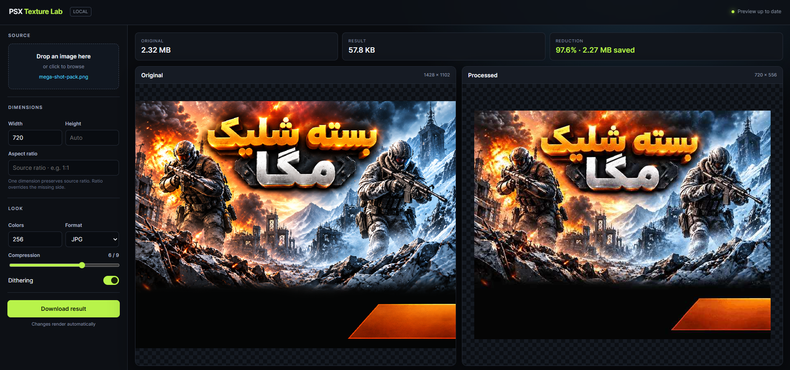

<div align="center">

# PSX Texture Lab

**A fast, local playground for resizing, palette reduction, dithering, and image compression.**

[](https://www.python.org/)
[](https://python-pillow.org/)
[](#privacy)



</div>

## Overview

PSX Texture Lab converts images into lightweight, retro-friendly textures. It includes a live browser playground for visual comparison and a command-line interface for scripts and batch workflows.

- Live, side-by-side original and processed previews
- Automatic conversion whenever a setting changes
- PNG and JPEG output with format-specific compression
- Palette reduction and optional Floyd–Steinberg dithering
- Exact sizing, one-dimension proportional scaling, and custom aspect ratios
- Original size, output size, percentage reduction, and bytes saved
- Local processing with downloadable results stored in the system temp folder

## Quick start

### Windows playground

1. Install [Python 3.9 or newer](https://www.python.org/downloads/) if it is not already installed.
2. Double-click **`run.cmd`**.
3. The launcher installs Pillow automatically when needed and opens the playground in your browser.
4. Drop an image into the source panel and adjust the settings. Results update automatically.

The local interface runs at:

```text
http://127.0.0.1:8765
```

Close the launcher window or press <kbd>Ctrl</kbd> + <kbd>C</kbd> to stop the server.

## Playground options

| Option | Description |
| --- | --- |
| **Width** | Sets the output width. If height is empty, the source aspect ratio is preserved. |
| **Height** | Sets the output height. If width is empty, the source aspect ratio is preserved. |
| **Aspect ratio** | Sets a target ratio such as `1:1`, `4:3`, or `16:9`. With no dimensions, the largest size fitting inside the source is used. |
| **Colors** | Sets the palette limit from 2 to 256 colors. Lower values produce a stronger retro look. |
| **Format** | Selects PNG or JPEG output. |
| **Compression** | Sets compression from 0 to 9. Higher levels favor smaller output over image quality. |
| **Dithering** | Uses Floyd–Steinberg dithering to simulate missing colors and soften color banding. |

### Compression behavior

Compression is tailored to the selected format:

- **PNG:** increases lossless encoder compression and progressively reduces the palette at stronger levels. Level 9 limits the result to 16 colors.
- **JPEG:** progressively lowers JPEG quality. Stronger levels also use chroma subsampling and progressive encoding.

Always compare the processed preview at its intended display size before choosing a final level.

## Command-line usage

Run commands from the project root:

```powershell
python app/PSXTexture.py -i input.png -o output.png
```

### Examples

Resize to 512 pixels wide while preserving the source aspect ratio:

```powershell
python app/PSXTexture.py -i input.png -o output.png -w 512
```

Create a 512 × 512 JPEG with dithering and strong compression:

```powershell
python app/PSXTexture.py -i input.png -o output.jpg -w 512 --ar 1:1 -d --compression 7
```

Create the largest 16:9 image that fits inside the source:

```powershell
python app/PSXTexture.py -i input.png -o output.png --ar 16:9
```

Reduce an image to 64 colors:

```powershell
python app/PSXTexture.py -i input.png -o output.png -c 64
```

### CLI reference

| Argument | Long form | Value | Description |
| --- | --- | --- | --- |
| `-i` | `--input` | Path | Source image. Required. |
| `-o` | `--output` | Path | Output `.png`, `.jpg`, or `.jpeg` path. Required. |
| `-c` | `--colors` | `2–256` | Maximum palette colors. Default: `256`. |
| `-d` | `--dither` | Flag | Enables Floyd–Steinberg dithering. |
| `-w` | `--width` | Pixels | Output width. Derives height if omitted. |
| `-h` | `--height` | Pixels | Output height. Derives width if omitted. |
|  | `--ar` | `W:H` | Target aspect ratio, for example `1:1` or `16:9`. |
|  | `--compression` | `0–9` | Higher levels reduce size while sacrificing more quality. |
| `-p` | `--preview` | Flag | Opens the desktop comparison viewer after conversion. |
|  | `--help` | Flag | Displays command-line help. |

When both width and height are supplied without `--ar`, the output uses those exact dimensions. When `--ar` is supplied with width, width controls the scale; when supplied with height only, height controls the scale.

## Project structure

```text
python/
├── run.cmd                    # Installs dependencies when needed and starts the app
├── README.md
└── app/
    ├── PSXTexture.py          # Image conversion and CLI
    ├── PSXTextureWeb.py       # Local playground server
    ├── PSXTexture.html        # Playground interface
    ├── requirements.txt
    └── assets/
        └── hero.png
```

## Manual installation

If you prefer not to use `run.cmd`:

```powershell
python -m pip install -r app/requirements.txt
python app/PSXTextureWeb.py
```

## Temporary files

Playground results are written to the operating system temp directory:

```text
%TEMP%\psx_texture_playground
```

These files can be deleted safely after closing the playground.

## Privacy

Images are processed entirely on your computer. The server listens only on `127.0.0.1`; images are not uploaded to an external service.

## Troubleshooting

### The browser does not open

Open [http://127.0.0.1:8765](http://127.0.0.1:8765) manually while `run.cmd` is running.

### Python is not found

Install Python and enable **Add Python to PATH** during installation, then run `run.cmd` again.

### Port 8765 is already in use

Close another running PSX Texture Lab window or stop the process using port 8765, then restart the launcher.

### The output is larger than the source

Try a smaller dimension, fewer colors, a higher compression level, or JPEG output. PNG is usually better for pixel art and sharp graphics; JPEG is often smaller for detailed images and photographs.

## Contributing

Issues and pull requests are welcome. When changing image processing behavior, include before-and-after samples and note the settings used.
